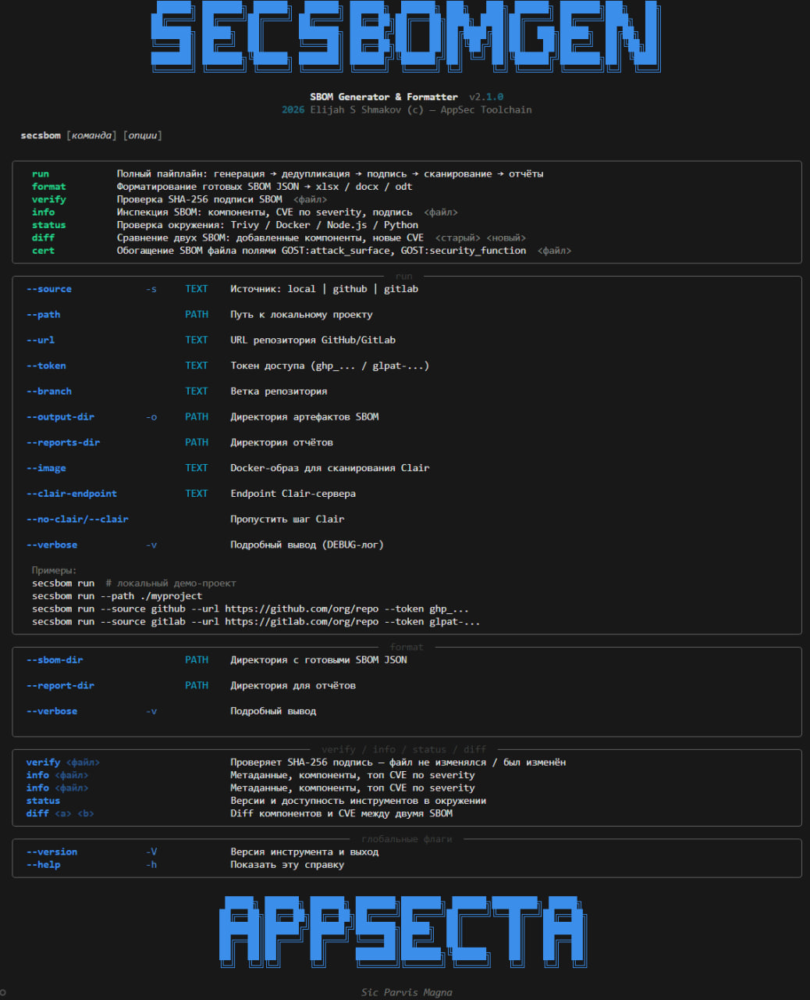
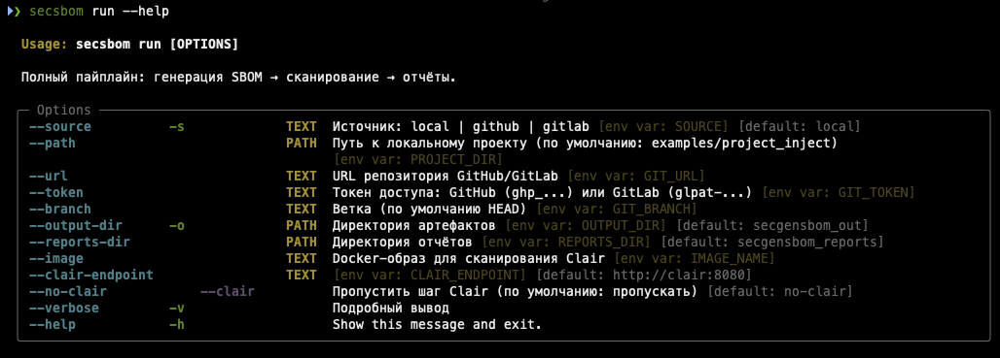

<div align="center">
<h1><a id="intro"> SBOM Security Generator & Formatter  <sup></sup></a><br></h1>
<a href="https://docs.github.com/en"></a>
<a href="https://daringfireball.net/projects/markdown"></a>
<a href="https://symbl.cc/en/unicode-table"></a>
<a href="https://shields.io"></a>

</div>

<div align="center">


</div>

<div align="center">

[](https://github.com/geminishkv/sbom_genform/actions/workflows/ci.yml)
[](https://hub.docker.com/r/geminishkvdev/sbom-pipeline)
[](https://pypi.org/project/sbom-pipeline/)
[](https://pypi.org/project/sbom-pipeline/)
[](LICENSE.md)
[](https://github.com/geminishkv/sbom_genform/packages)

</div>

Инструмент для безопасной генерации, анализа и форматирования **Software Bill of Materials (SBOM)**.

**Что делает:**

- Генерирует SBOM из локальной директории или Git-репозитория (GitHub / GitLab)
- Сканирует уязвимости через **Trivy**, **OWASP Dependency-Check**, **Clair**
- Встраивает найденные уязвимости в SBOM (CycloneDX 1.5)
- Опционально обогащает уязвимости идентификаторами **БДУ ФСТЭК**
- Экспортирует читаемые отчёты: **Excel (.xlsx)**, **Word (.docx)**, **ODT (.odt)**
- Подписывает итоговый SBOM (SHA-256)

***

## Main CLI



***

## Run help



***

## Установка

**PyPI:**

```bash
pip install sbom-pipeline
```

**GitHub Packages:**

```bash
pip install sbom-pipeline \
  --index-url https://${GITHUB_TOKEN}@pypi.pkg.github.com/geminishkv/
```

**Исходники:**

```bash
git clone https://github.com/geminishkv/sbom_genform.git
cd sbom_genform
python3 -m venv venv && source venv/bin/activate
pip install -e ".[dev]"
```

***

## Выходные артефакты

### SBOM JSON

| Файл                                    | Описание                        |
| --------------------------------------- | ------------------------------- |
| `secgensbom_out/app-bom-cdxgen.json`    | Исходный SBOM                   |
| `secgensbom_out/app-bom-dedup.json`     | После дедупликации              |
| `secgensbom_out/merged-bom-signed.json` | Подписанный SBOM с уязвимостями |
| `secgensbom_out/report_name(cert)`      | Отчет с добавлением полей GOST  |
| `secgensbom_out/merged-bom-signed.sig`  | SHA-256 контрольная сумма       |
| `secgensbom_out/vulns-normalized.json`  | Нормализованные уязвимости      |

Если включено BDU-обогащение, в `merged-bom-signed.json` идентификатор БДУ записывается в `vulnerabilities[].properties[]` как свойство с именем `ru.fstec.bdu:id`.

### Отчёты сканеров

| Путь | Сканер |
| --- | --- |
| `secgensbom_out/trivy/trivy-fs.json` | Trivy — файловая система |
| `secgensbom_out/trivy/sbom-vulns.json` | Trivy — анализ SBOM |
| `secgensbom_out/dependency-check/` | OWASP Dependency-Check |
| `secgensbom_out/clair/` | Clair (если включён) |

### Reports

| Путь                              | Формат | Содержимое                                |
| --------------------------------- | ------ | ----------------------------------------- |
| `secgensbom_reports/excel/*.xlsx` | Excel  | Лист 1: компоненты, Лист 2: уязвимости    |
| `secgensbom_reports/docx/*.docx`  | Word   | Таблица компонентов + таблица уязвимостей |
| `secgensbom_reports/odt/*.odt`    | ODT    | То же самое                               |

Если пайплайн запущен с `--bdu` или `BDU=true`, во всех форматах отчётов уязвимостей появляется отдельная колонка `BDU / ID`. Если BDU-обогащение выключено, эта колонка не выводится.

---

## BDU Enrichment

Обогащение идентификаторами БДУ ФСТЭК выключено по умолчанию.

Включение через CLI:

```bash
secsbom run --bdu
```

Включение через переменную окружения:

```bash
export BDU=true
secsbom run
```

При включённом BDU пайплайн:

- запрашивает соответствия `CVE -> BDU ID` через `bdu.fstec.ru`
- добавляет BDU ID в итоговый CycloneDX SBOM как свойство уязвимости
- выводит BDU ID в экспортируемые отчёты

Пример фрагмента SBOM:

```json
{
  "id": "CVE-2023-1234",
  "properties": [
    {
      "name": "ru.fstec.bdu:id",
      "value": "BDU:2023-01813"
    }
  ]
}
```

---

## Docker

Образ включает Python, Trivy, Docker CLI и Node.js/npx (cdxgen для non-Python проектов).
OWASP Dependency-Check запускается отдельно — его Java-зависимость утяжелила бы образ на ~400 МБ.

### Docker Hub

```bash
docker pull geminishkv/sbom-pipeline:latest

docker run --rm \
  -v "$(pwd)/examples/project_inject:/app/project_inject" \
  -v "$(pwd)/secgensbom_out:/app/secgensbom_out" \
  -v "$(pwd)/secgensbom_reports:/app/secgensbom_reports" \
  -v /var/run/docker.sock:/var/run/docker.sock \
  geminishkv/sbom-pipeline:latest
```

***

## CI/CD

### GitHub Actions

| Workflow         | Триггер              | Назначение                                              |
| ---------------- | -------------------- | ------------------------------------------------------- |
| `ci.yml`         | push / PR → main     | lint + mypy + pytest (3.11–3.13)                        |
| `secgensbom.yml` | push → main, вручную | запуск пайплайна, сохранение SBOM и отчётов             |
| `publish.yml`    | тег `v*.*.*`         | GitHub Packages + PyPI + Docker Hub + GitHub Release    |

**Публикация новой версии** — один тег запускает всё:

```bash
git tag v2.1.0
git push --tags
```

### Shared template

Файл `secgensbom/secgensbom.yml` — это **переиспользуемый шаблон CI** для GitLab. Любой другой проект в GitLab может подключить готовый SBOM-шаг одной строкой, не копируя конфигурацию:

***

## Архитектура

### Пайплайн `secsbom run`


***

## Структура репозитория

```text
sbom_genform/
├── src/sbom_pipeline/
│   ├── cli.py            # secsbom / secsbom-pipeline (typer)
│   ├── pipeline.py       # оркестратор
│   ├── generate.py       # генерация SBOM
│   ├── dedup.py          # дедупликация
│   ├── sign.py           # SHA-256 подпись
│   ├── exporter.py       # xlsx / docx / odt
│   ├── vuln_merger.py    # встраивание уязвимостей
│   ├── config.py         # конфигурация
│   └── scanner/
│       ├── trivy.py
│       ├── depcheck.py
│       └── clair.py
├── docker/
│   └── Dockerfile.secgensbom
├── examples/project_inject/   # уязвимый PHP проект
├── secgensbom/secgensbom.yml  # GitLab CI shared template
├── .github/workflows/
│   ├── ci.yml
│   ├── secgensbom.yml
│   └── publish.yml
├── tests/test_smoke.py
├── pyproject.toml
└── .env.example
```

***

Copyright (c) 2025 Elijah S Shmakov


