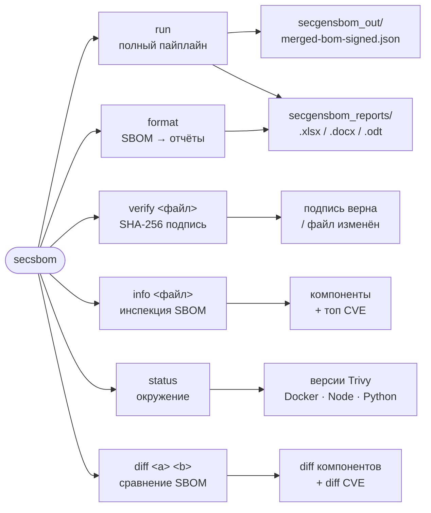

<div align="center">
<h1><a id="intro"> SBOM Generator & Formatter  <sup></sup></a><br></h1>
<a href="https://docs.github.com/en"></a>
<a href="https://daringfireball.net/projects/markdown"></a>
<a href="https://symbl.cc/en/unicode-table"></a>
<a href="https://shields.io"></a>

</div>

<div align="center">


</div>

<div align="center">

[](https://github.com/geminishkv/sbom_genformatter/actions/workflows/ci.yml)
[](https://hub.docker.com/r/geminishkv/sbom-pipeline)
[](https://pypi.org/project/sbom-pipeline/)
[](https://pypi.org/project/sbom-pipeline/)
[](LICENSE.md)
[](https://github.com/geminishkv/sbom_genformatter/packages)

</div>

Инструмент для генерации, анализа и форматирования **Software Bill of Materials (SBOM)**.
Полный Python-пайплайн — без shell-скриптов.

**Что делает:**

- Генерирует SBOM из локальной директории или Git-репозитория (GitHub / GitLab)
- Сканирует уязвимости через **Trivy**, **OWASP Dependency-Check**, **Clair**
- Встраивает найденные уязвимости в SBOM (CycloneDX 1.5)
- Экспортирует читаемые отчёты: **Excel (.xlsx)**, **Word (.docx)**, **ODT (.odt)**
- Подписывает итоговый SBOM (SHA-256)

---

## Установка

**Из PyPI:**

```bash
pip install sbom-pipeline
```

**Из GitHub Packages:**

```bash
pip install sbom-pipeline \
  --index-url https://${GITHUB_TOKEN}@pypi.pkg.github.com/geminishkv/
```

**Из исходников (для разработки):**

```bash
git clone https://github.com/geminishkv/sbom_genformatter.git
cd sbom_genformatter
python3 -m venv venv && source venv/bin/activate
pip install -e ".[dev]"
```

---

## CLI — быстрый старт

После установки доступны два алиаса для одного инструмента:

```text
secsbom             ← короткий алиас
secsbom-pipeline    ← полный алиас
```

Запуск без аргументов выводит полную справку по всем командам и опциям:

```bash
secsbom
secsbom --version
```

### run — полный пайплайн

```bash
# Локальный демо-проект
secsbom run
secsbom run --path examples/project_inject

# GitHub-репозиторий
secsbom run --source github --url https://github.com/org/repo --token ghp_...

# GitLab-репозиторий
secsbom run --source gitlab --url https://gitlab.com/org/repo --token glpat-...

# Кастомные пути вывода
secsbom run --path /path/to/project --output-dir ./out --reports-dir ./reports

# Verbose-режим
secsbom run -v
```

### format — SBOM → отчёты

```bash
secsbom format --sbom-dir secgensbom_out --report-dir secgensbom_reports
```

### verify — проверка SHA-256 подписи

```bash
secsbom verify secgensbom_out/merged-bom-signed.json
# Подпись верна / файл изменён или подпись отсутствует
```

### info — инспекция SBOM

```bash
secsbom info secgensbom_out/merged-bom-signed.json
# выводит: метаданные, число компонентов по экосистемам, топ CVE по severity
```

### status — проверка окружения

```bash
secsbom status
# выводит: версии Python, Trivy, Docker, Node.js, npx, cyclonedx-py
# при отсутствии — подсказку по установке
```

### diff — сравнение двух SBOM

```bash
secsbom diff secgensbom_out/old-bom.json secgensbom_out/new-bom.json
# показывает добавленные/удалённые компоненты и новые/закрытые CVE
```

---

## Переменные окружения

Скопируй `.env.example` → `.env`. CLI-флаги имеют приоритет над переменными.

| Переменная        | CLI-флаг             | По умолчанию              |
| ----------------- | -------------------- | ------------------------- |
| `SOURCE`          | `--source`           | `local`                   |
| `PROJECT_DIR`     | `--path`             | `examples/project_inject` |
| `GIT_URL`         | `--url`              | —                         |
| `GIT_TOKEN`       | `--token`            | —                         |
| `GIT_BRANCH`      | `--branch`           | HEAD                      |
| `OUTPUT_DIR`      | `--output-dir`       | `secgensbom_out`          |
| `REPORTS_DIR`     | `--reports-dir`      | `secgensbom_reports`      |
| `IMAGE_NAME`      | `--image`            | —                         |
| `CLAIR_ENDPOINT`  | `--clair-endpoint`   | `http://clair:8080`       |
| `SKIP_CLAIR`      | `--no-clair/--clair` | `true`                    |
| `GITHUB_TOKEN`    | —                    | —                         |

---

## Выходные артефакты

### SBOM JSON

| Файл                                    | Описание                        |
| --------------------------------------- | ------------------------------- |
| `secgensbom_out/app-bom-cdxgen.json`    | Исходный SBOM                   |
| `secgensbom_out/app-bom-dedup.json`     | После дедупликации              |
| `secgensbom_out/merged-bom-signed.json` | Подписанный SBOM с уязвимостями |
| `secgensbom_out/merged-bom-signed.sig`  | SHA-256 контрольная сумма       |
| `secgensbom_out/vulns-normalized.json`  | Нормализованные уязвимости      |

### Отчёты сканеров

| Путь | Сканер |
| --- | --- |
| `secgensbom_out/trivy/trivy-fs.json` | Trivy — файловая система |
| `secgensbom_out/trivy/sbom-vulns.json` | Trivy — анализ SBOM |
| `secgensbom_out/dependency-check/` | OWASP Dependency-Check |
| `secgensbom_out/clair/` | Clair (если включён) |

### Читаемые отчёты

| Путь                              | Формат | Содержимое                                |
| --------------------------------- | ------ | ----------------------------------------- |
| `secgensbom_reports/excel/*.xlsx` | Excel  | Лист 1: компоненты, Лист 2: уязвимости    |
| `secgensbom_reports/docx/*.docx`  | Word   | Таблица компонентов + таблица уязвимостей |
| `secgensbom_reports/odt/*.odt`    | ODT    | То же самое                               |

---

## Docker

Образ включает Python, Trivy, Docker CLI и Node.js/npx (cdxgen для non-Python проектов).
OWASP Dependency-Check запускается отдельно — его Java-зависимость утяжелила бы образ на ~400 МБ.

### Docker Hub

```bash
docker pull geminishkv/sbom-pipeline:latest
```

**Локальный проект:**

```bash
docker run --rm \
  -v "$(pwd)/examples/project_inject:/app/project_inject" \
  -v "$(pwd)/secgensbom_out:/app/secgensbom_out" \
  -v "$(pwd)/secgensbom_reports:/app/secgensbom_reports" \
  -v /var/run/docker.sock:/var/run/docker.sock \
  geminishkv/sbom-pipeline:latest
```

**GitHub-репозиторий:**

```bash
docker run --rm \
  -v "$(pwd)/secgensbom_out:/app/secgensbom_out" \
  -v "$(pwd)/secgensbom_reports:/app/secgensbom_reports" \
  -e SOURCE=github \
  -e GIT_URL=https://github.com/org/repo \
  -e GIT_TOKEN=ghp_... \
  geminishkv/sbom-pipeline:latest
```

### Сборка из исходников

```bash
docker build -f docker/Dockerfile.secgensbom -t sbom-pipeline:local .
```

---

## CI/CD

### GitHub Actions

| Workflow         | Триггер              | Назначение                                              |
| ---------------- | -------------------- | ------------------------------------------------------- |
| `ci.yml`         | push / PR → main     | lint + mypy + pytest (3.11–3.13)                        |
| `secgensbom.yml` | push → main, вручную | запуск пайплайна, сохранение SBOM и отчётов             |
| `publish.yml`    | тег `v*.*.*`         | GitHub Packages + PyPI + Docker Hub + GitHub Release    |

**Публикация новой версии** — один тег запускает всё:

```bash
git tag v2.1.0
git push --tags
```

**GitHub Secrets** (`Settings → Secrets and variables → Actions`):

| Тип      | Имя                  | Значение                                           |
| -------- | -------------------- | -------------------------------------------------- |
| Secret   | `PYPI_API_TOKEN`     | API-токен PyPI (`pypi-...`)                        |
| Secret   | `DOCKERHUB_TOKEN`    | Access Token Docker Hub (`hub.docker.com → Security`) |
| Variable | `DOCKERHUB_USERNAME` | Логин Docker Hub (например, `geminishkv`)          |

### GitLab CI — shared template (`secgensbom/secgensbom.yml`)

Файл `secgensbom/secgensbom.yml` — это **переиспользуемый шаблон CI** для GitLab.
Любой другой проект в GitLab может подключить готовый SBOM-шаг одной строкой, не копируя конфигурацию:

```yaml
# В .gitlab-ci.yml вашего проекта:
include:
  - project: 'your-group/sbom_genformatter'
    file: 'secgensbom/secgensbom.yml'
```

После этого в пайплайне автоматически появится шаг:

- **`secgensbom_pipeline`** — запуск `secsbom-pipeline run`, артефакты SBOM и отчётов сохраняются в CI

Переменные CI (`Settings → CI/CD → Variables`):

| Переменная                                          | Описание                          |
| --------------------------------------------------- | --------------------------------- |
| `SOURCE`                                            | `local` / `github` / `gitlab`     |
| `GIT_URL`                                           | URL репозитория                   |
| `GIT_TOKEN`                                         | Токен для приватных репо          |
| `DOCKER_REGISTRY`, `DOCKER_USER`, `DOCKER_PASSWORD` | Реестр образов (опционально)      |

---

## Архитектура

### Пайплайн `secsbom run`

```mermaid
flowchart TD
    IN(["Источник\nlocal / github / gitlab"]) --> GEN

    subgraph pipeline["secsbom run — этапы"]
        GEN["1 · generate.py\napp-bom-cdxgen.json"]
        GEN --> DEDUP["2 · dedup.py\napp-bom-dedup.json\nдедупликация по PURL"]
        DEDUP --> SIGN["3 · sign.py\nmerged-bom-signed.json + .sig\nSHA-256 в metadata.signature"]
        SIGN --> SCAN

        subgraph SCAN["4 · scanner/"]
            direction LR
            TRIVY["trivy.py\ntrivy-fs.json\nsbom-vulns.json"]
            DEPCHECK["depcheck.py\ndependency-check-report.*"]
            CLAIR["clair.py\nclair-*.json\n(если --clair)"]
        end

        TRIVY & DEPCHECK & CLAIR --> MERGE["5 · vuln_merger.py\nvulnerabilities&#91;&#93; в SBOM"]
        MERGE --> EXPORT["6 · exporter.py"]
    end

    EXPORT --> XLSX["secgensbom_reports/\n*.xlsx"]
    EXPORT --> DOCX["secgensbom_reports/\n*.docx"]
    EXPORT --> ODT["secgensbom_reports/\n*.odt"]
```



### CLI-команды



---

## Структура репозитория

```text
sbom_genformatter/
├── src/sbom_pipeline/
│   ├── cli.py            # secsbom / secsbom-pipeline (typer)
│   ├── pipeline.py       # оркестратор
│   ├── generate.py       # генерация SBOM
│   ├── dedup.py          # дедупликация
│   ├── sign.py           # SHA-256 подпись
│   ├── exporter.py       # xlsx / docx / odt
│   ├── vuln_merger.py    # встраивание уязвимостей
│   ├── config.py         # конфигурация
│   └── scanner/
│       ├── trivy.py
│       ├── depcheck.py
│       └── clair.py
├── docker/
│   └── Dockerfile.secgensbom
├── examples/project_inject/   # уязвимый PHP-демо-проект
├── secgensbom/secgensbom.yml  # GitLab CI shared template
├── .github/workflows/
│   ├── ci.yml
│   ├── secgensbom.yml
│   └── publish.yml
├── tests/test_smoke.py
├── pyproject.toml
└── .env.example
```

---

Copyright (c) 2025 Elijah S Shmakov


